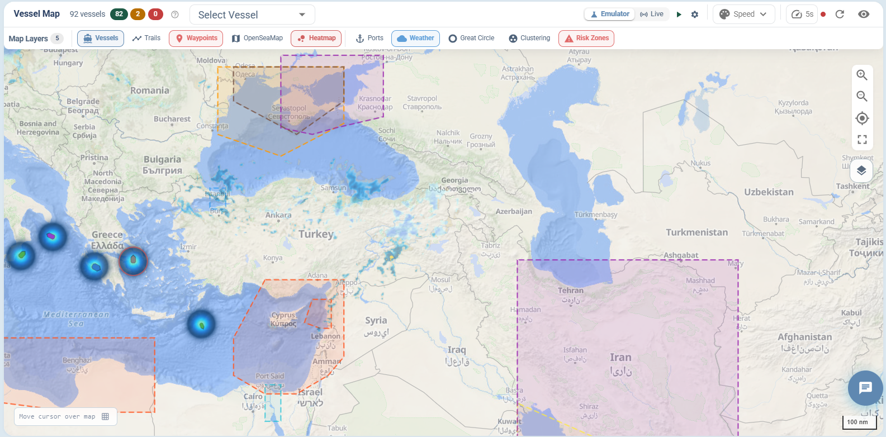
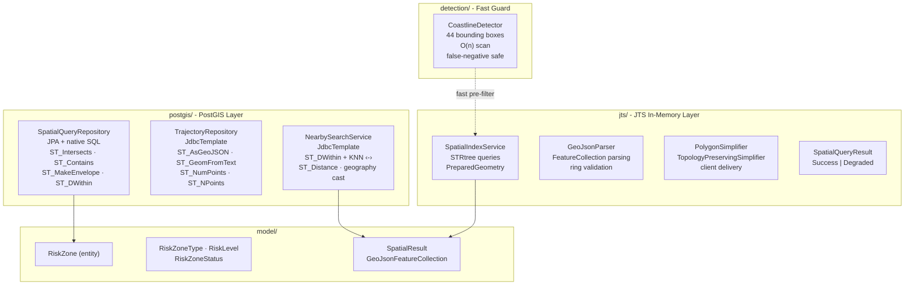

# spatialkit - PostGIS Spatial Query Engine & Geofencing Toolkit



A focused Kotlin/Spring Boot module demonstrating spatial query patterns extracted from a production maritime platform:

- **PostGIS native queries** - ST_Intersects, ST_Contains, ST_MakeEnvelope, ST_DWithin, KNN ordering with `<->`
- **JTS in-memory spatial indexing** - STRtree bulk-load, PreparedGeometry, TopologyPreservingSimplifier
- **Trajectory GeoJSON management** - ST_AsGeoJSON, ST_GeomFromText, ST_NumPoints via JdbcTemplate
- **Geofence point-in-polygon** - active zone window queries with temporal filtering
- **Coastline detection** - 44-box O(n) bounding-box scan for dead-reckoning guard

---

## Architecture



---

## Tech Stack

| Component | Version |
|---|---|
| Kotlin | 1.9.25 |
| Spring Boot | 3.2.5 |
| Spring Data JPA | 3.2.x |
| Hibernate Spatial | 6.6.4.Final |
| PostgreSQL JDBC | 42.7.3 |
| JTS Core | 1.19.0 |
| JUnit 5 | 5.10.x |
| MockK | 1.13.10 |

---

## Key PostGIS Queries

### Viewport / Bounding-Box Filter (ST_Intersects + ST_MakeEnvelope)

```sql
SELECT z.* FROM risk_zones z
WHERE z.status = 'ACTIVE' AND z.is_active = true
  AND z.effective_from <= :now
  AND (z.effective_until IS NULL OR z.effective_until > :now)
  AND ST_Intersects(z.geometry, ST_MakeEnvelope(:minLon, :minLat, :maxLon, :maxLat, 4326))
```

`ST_MakeEnvelope` builds a rectangular polygon from four corner coordinates in one step. The GIST index on `geometry` makes this O(log n).

### Geofence Point-in-Polygon (ST_Covers + ST_Point)

```sql
SELECT z.* FROM risk_zones z
WHERE z.status = 'ACTIVE' AND z.is_active = true
  AND z.effective_from <= :now
  AND (z.effective_until IS NULL OR z.effective_until > :now)
  AND ST_Covers(z.geometry, ST_SetSRID(ST_Point(:lon, :lat), 4326))
```

`ST_Covers` includes boundary points - a vessel on the zone border is considered inside. `ST_Contains` would exclude it, which is incorrect for risk zone semantics.

### KNN Nearest-Neighbour Search

```sql
SELECT
    p.id,
    p.name,
    ST_Distance(p.location, ST_SetSRID(ST_MakePoint(?, ?), 4326)::geography) / 1852.0 AS distance_nm
FROM spatial_points p
WHERE ST_DWithin(p.location, ST_SetSRID(ST_MakePoint(?, ?), 4326)::geography, ?)
ORDER BY p.location <-> ST_SetSRID(ST_MakePoint(?, ?), 4326)::geography
LIMIT ?
```

`ST_DWithin` uses the GIST index to pre-filter. The `<->` KNN operator sorts survivors by sphere distance (negligible difference from spheroid at radii below ~200 nm). `ST_Distance` computes exact spheroid distance only for the LIMIT result rows.

### Geodesic Distance (GEOGRAPHY cast)

```sql
SELECT ST_Distance(
    ST_SetSRID(ST_MakePoint(?, ?), 4326)::geography,
    ST_SetSRID(ST_MakePoint(?, ?), 4326)::geography
) / 1852.0
```

The `::geography` cast forces WGS84 spheroidal math. Without it, ST_Distance uses planar Cartesian geometry which diverges significantly beyond ~100 km.

---

## JTS Spatial Index - How It Works

```
Startup:
  GeoJSON file → parse to JTS Geometry[]
  → STRtree.insert(geometry.envelopeInternal, PreparedGeometryFactory.create(geometry))
  → STRtree.build()   ← bulk-load Sort-Tile-Recursive packing

Per query (isOnLand / crossesLand):
  point/line.envelopeInternal
  → STRtree.query(envelope)       ← O(log n) index lookup
  → PreparedGeometry.contains()   ← O(1) amortised per candidate
```

PreparedGeometry pre-computes the edge-noding structure once, making repeated `contains()` / `intersects()` calls approximately 100× faster than raw `Geometry.contains()` on complex Natural Earth polygons.

---

## Error Contracts

### SpatialQueryResult - Degraded Mode

`SpatialIndexService` methods return `SpatialQueryResult<T>` instead of raw values. When land polygon data is not loaded (missing GeoJSON, disabled by config), the result is `Degraded(fallback, reason)` rather than a silent conservative answer. Callers can distinguish "point is on land" from "we don't know because data isn't loaded":

```kotlin
when (val result = spatialIndexService.isOnLand(lat, lon)) {
    is SpatialQueryResult.Success -> handleResult(result.value)
    is SpatialQueryResult.Degraded -> alertDegradedMode(result.reason)
}
```

### Input Validation

All public spatial methods validate coordinates with `require()`:
- Latitude must be in `[-90, 90]`
- Longitude must be in `[-180, 180]`
- Radius and limit must be positive

Invalid inputs throw `IllegalArgumentException` at the method boundary rather than propagating to SQL/JTS as undefined behavior.

### PostGIS Exception Propagation

`NearbySearchService` lets JDBC/PostGIS exceptions propagate to the caller - no silent `emptyList()` or `null` on infrastructure failure. `TrajectoryRepository.updatePlannedTrajectory()` throws `NoSuchElementException` when the target row doesn't exist.

---

## Required Indexes

Spatial queries depend on GIST indexes for performance:

```sql
CREATE INDEX IF NOT EXISTS idx_spatial_points_location_gist
    ON spatial_points USING GIST (location);

CREATE INDEX IF NOT EXISTS idx_risk_zones_geometry_gist
    ON risk_zones USING GIST (geometry);

CREATE INDEX IF NOT EXISTS idx_risk_zones_active_window
    ON risk_zones (status, is_active, effective_from, effective_until);
```

Without these, `ST_DWithin`, `ST_Intersects`, and `ST_Covers` fall back to sequential scan.

---

## How to Build

```bash
./gradlew test       # unit tests - no database or GeoJSON files required
./gradlew build      # full build + tests
```

Tests use synthetic in-memory JTS polygons. No external dependencies at test time.

To run the full application with PostGIS:

```bash
# Start PostGIS
docker run -e POSTGRES_PASSWORD=postgres -p 5432:5432 postgis/postgis:16-3.4

# Configure application.properties
spring.datasource.url=jdbc:postgresql://localhost:5432/spatialkit
spring.datasource.username=postgres
spring.datasource.password=postgres
spring.jpa.database-platform=org.hibernate.dialect.PostgreSQLDialect

./gradlew bootRun
```

To enable land polygon queries, place Natural Earth GeoJSON files under `src/main/resources/geodata/`:

- `ne_10m_land.geojson` - 10m land polygons (detail queries)
- `ne_50m_land.geojson` - 50m simplified (frontend delivery)
- `ne_10m_lakes.geojson` - lakes (interior water body override)

Download from [naturalearthdata.com](https://www.naturalearthdata.com/downloads/10m-physical-vectors/).

---

## Project Structure

```
spatialkit/
├── build.gradle.kts
├── settings.gradle.kts
├── CLAUDE.md
└── src/
    ├── main/kotlin/com/spatialkit/
    │   ├── SpatialKitApplication.kt
    │   ├── config/
    │   │   └── SpatialConfig.kt               JPA auditing config
    │   ├── detection/
    │   │   └── CoastlineDetector.kt           44-box O(n) bounding-box scan
    │   ├── jts/
    │   │   ├── GeoJsonParser.kt               FeatureCollection/Polygon parsing + validation
    │   │   ├── PolygonSimplifier.kt           TopologyPreservingSimplifier for client delivery
    │   │   ├── SpatialIndexService.kt         STRtree + PreparedGeometry queries
    │   │   └── SpatialQueryResult.kt          Success | Degraded sealed result type
    │   ├── model/
    │   │   ├── RiskZone.kt                    JPA entity + BaseEntity
    │   │   ├── SpatialResult.kt               GeoJSON result types
    │   │   └── enums/
    │   │       └── RiskZoneEnums.kt           RiskZoneType, RiskLevel, RiskZoneStatus
    │   └── postgis/
    │       ├── NearbySearchService.kt         KNN + ST_DWithin + geodesic distance
    │       ├── SpatialQueryRepository.kt      ST_Intersects + ST_Contains JPA queries
    │       └── TrajectoryRepository.kt        ST_AsGeoJSON + ST_GeomFromText
    └── test/kotlin/com/spatialkit/
        ├── CoastlineDetectorTest.kt           44-box coverage + ocean false-positive tests
        ├── SpatialIndexServiceTest.kt        Degraded mode, input validation, GeoJSON parsing
        └── SpatialQueryTest.kt                STRtree, PreparedGeometry, line-crossing tests
```

---

## Release Status
**0.1.0** - API is stabilising but not yet frozen. Minor versions may include breaking changes until `1.0.0`.

---

## License
MIT - see [LICENSE](./LICENSE)
